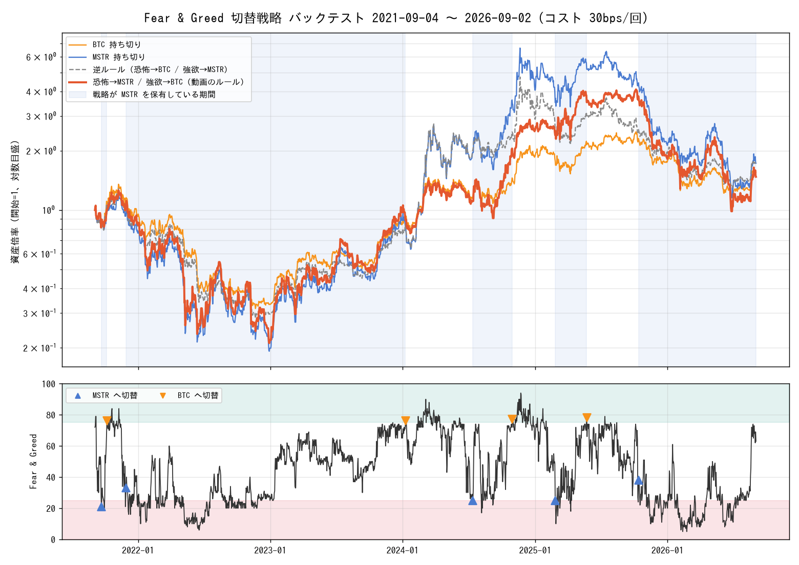
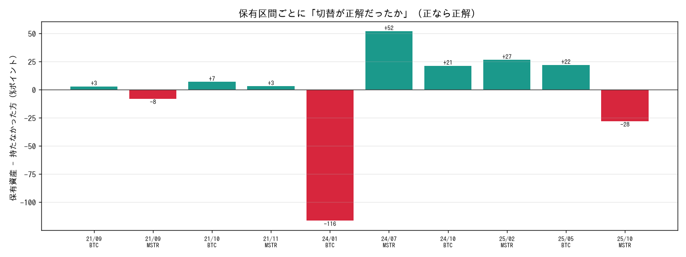
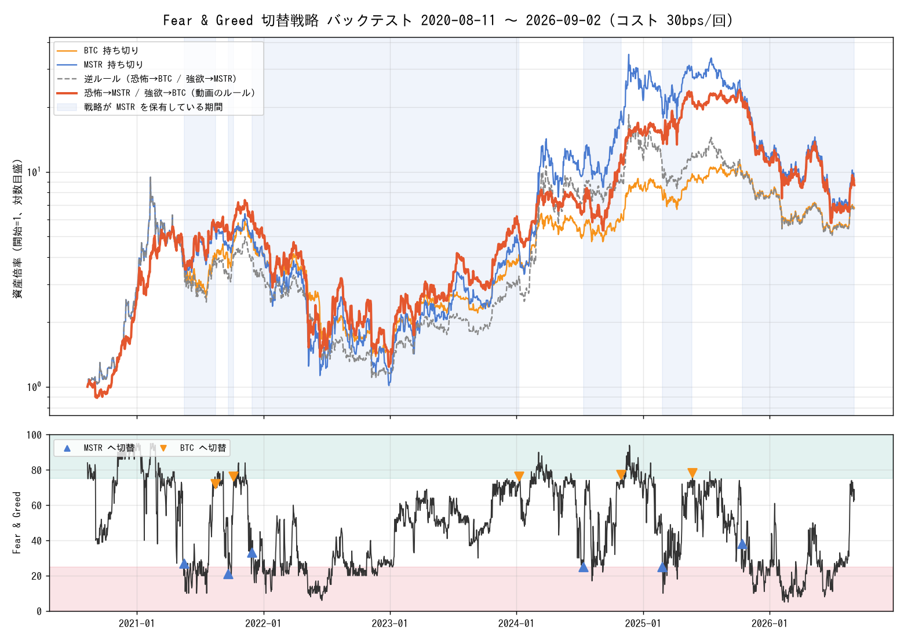
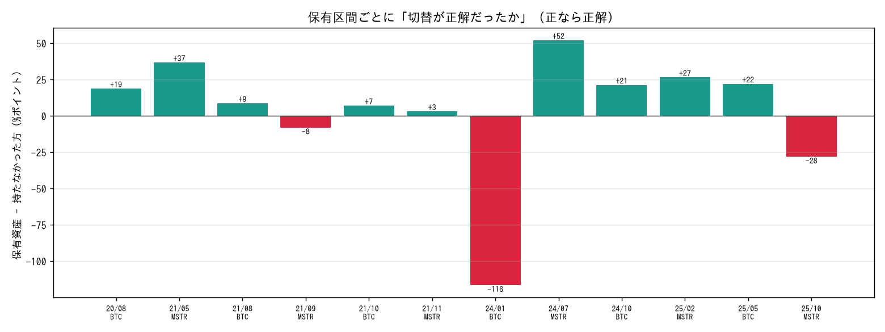

# Fear & Greed 切替戦略 バックテスト結果（2026-09-04 実施）

Kitco News のインタビューで Ran Neuner 氏が語った「Crypto Fear & Greed Index を使って
BTC 現物と MSTR（Strategy 社株）を切り替える」手法を、過去データで検証した記録。

## 検証したルール

| 指数の状態 | 動作 |
|---|---|
| 極端な恐怖（Extreme Fear）に入った日 | BTC 現物を売って MSTR を買う |
| 極端な強欲（Extreme Greed）に入った日 | MSTR を売って BTC 現物に戻す |
| それ以外 | 何もしない（常にどちらかを 100% 保有） |

## 前提とデータ

| 項目 | 内容 |
|---|---|
| 指数 | alternative.me の Crypto Fear & Greed Index 日次（2018-02-01〜）。分類ラベルをそのまま使用。観測された境界は 25 以下が Extreme Fear、76 以上が Extreme Greed |
| 価格 | Yahoo Finance の日足終値。MSTR は 2024 年 8 月の 10 分割を調整済み |
| 実行タイミング | 指数は毎日 00:00 UTC（日本時間 9:00）に公表。その日の終値で切替。米国市場の休場日は翌営業日の終値 |
| 休場日の MSTR | 直前の終値で据え置き（週末のリターンは 0） |
| 初期ポジション | 開始日より前の最後の極端シグナルから決定（ウォームスタート） |
| コスト | 切替 1 回あたり 0.3%（30bps）。0 と 0.5% も併記 |
| 税金 | 考慮していない（実運用では切替ごとに課税イベントが発生する） |
| データ最終日 | 2026-09-02 |

## 結果 1: 過去 5 年（2021-09-04 〜 2026-09-02）

| 戦略 | 最終倍率 | 年率 | 最大下落 | 年率ボラ | シャープ | 切替回数 | MSTR保有比率 |
|---|---|---|---|---|---|---|---|
| 恐怖→MSTR / 強欲→BTC（動画のルール） | 1.48倍 | +8.1% | -83.2% | 80% | 0.50 | 9 | 72% |
| 同上（コスト 0） | 1.52倍 | +8.7% | -83.2% | 80% | 0.51 | 9 | 72% |
| BTC 持ち切り | 1.55倍 | +9.1% | -76.6% | 52% | 0.43 | 0 | 0% |
| MSTR 持ち切り | 1.73倍 | +11.6% | -84.1% | 90% | 0.57 | 0 | 100% |
| 逆ルール（恐怖→BTC / 強欲→MSTR） | 1.72倍 | +11.4% | -78.0% | 66% | 0.49 | 9 | 28% |

年別リターン

| 年 | 動画のルール | BTC 持ち切り | MSTR 持ち切り |
|---|---|---|---|
| 2021（9月から） | -15.9% | -7.3% | -23.6% |
| 2022 | -74.0% | -64.3% | -74.0% |
| 2023 | +346.2% | +155.4% | +346.2% |
| 2024 | +159.9% | +121.1% | +358.5% |
| 2025 | -28.2% | -6.3% | -47.5% |
| 2026（9月2日まで） | -18.9% | -11.7% | -18.9% |





## 結果 2: MSTR が BTC を買い始めてからの全期間（2020-08-11 〜 2026-09-02）

| 戦略 | 最終倍率 | 年率 | 最大下落 | 年率ボラ | シャープ | 切替回数 | MSTR保有比率 |
|---|---|---|---|---|---|---|---|
| 恐怖→MSTR / 強欲→BTC（動画のルール） | 8.66倍 | +42.8% | -83.2% | 80% | 0.84 | 11 | 63% |
| 同上（コスト 0） | 8.95倍 | +43.6% | -83.2% | 80% | 0.85 | 11 | 63% |
| BTC 持ち切り | 6.77倍 | +37.1% | -76.6% | 57% | 0.84 | 0 | 0% |
| MSTR 持ち切り | 9.13倍 | +44.1% | -89.3% | 92% | 0.85 | 0 | 100% |
| 逆ルール（恐怖→BTC / 強欲→MSTR） | 6.68倍 | +36.8% | -88.4% | 74% | 0.79 | 11 | 37% |





## 保有区間ごとの検証（全期間、動画のルール）

「差」が正なら、その区間で持っていた資産が持たなかった方に勝ったことを意味する。

| 期間 | 日数 | 実行日の指数 | 保有 | 保有資産 | 持たなかった方 | 差 |
|---|---|---|---|---|---|---|
| 2020-08-11 〜 2021-05-17 | 279 | 84 | BTC | +281.6% | +262.8% | +18.8% |
| 2021-05-17 〜 2021-08-16 | 91 | 27 | MSTR | +42.5% | +5.7% | +36.9% |
| 2021-08-16 〜 2021-09-22 | 37 | 72 | BTC | -5.3% | -14.0% | +8.8% |
| 2021-09-22 〜 2021-10-07 | 15 | 21 | MSTR | +15.5% | +23.5% | -7.9% |
| 2021-10-07 〜 2021-11-29 | 53 | 76 | BTC | +7.4% | +0.4% | +7.0% |
| 2021-11-29 〜 2024-01-09 | 771 | 33 | MSTR | -17.0% | -20.2% | +3.2% |
| 2024-01-09 〜 2024-07-12 | 185 | 76 | BTC | +25.5% | +142.0% | -116.5% |
| 2024-07-12 〜 2024-10-30 | 110 | 25 | MSTR | +77.1% | +24.9% | +52.1% |
| 2024-10-30 〜 2025-02-25 | 118 | 77 | BTC | +22.7% | +1.3% | +21.4% |
| 2025-02-25 〜 2025-05-23 | 87 | 25 | MSTR | +47.5% | +20.9% | +26.6% |
| 2025-05-23 〜 2025-10-13 | 143 | 78 | BTC | +7.4% | -14.6% | +22.1% |
| 2025-10-13 〜 2026-09-02（継続中） | 324 | 38 | MSTR | -61.0% | -32.9% | -28.0% |

正解だった区間: 9 / 12。ただし損益は 2024 年前半（MSTR プレミアム急拡大を取り逃した）と
2025 年 10 月以降（プレミアム崩壊局面で MSTR を保有）の 2 区間でほぼ決まっている。

## 開始日を変えた場合（終了日は 2026-09-02 で固定、コスト 30bps）

| 開始日 | 初期 | 戦略倍率 | BTC倍率 | MSTR倍率 | 戦略÷BTC | 戦略÷MSTR | 切替 |
|---|---|---|---|---|---|---|---|
| 2020-10-01 | BTC | 9.30 | 7.28 | 8.27 | 1.28 | 1.12 | 11 |
| 2021-01-01 | BTC | 3.36 | 2.63 | 3.17 | 1.28 | 1.06 | 11 |
| 2021-04-01 | BTC | 1.67 | 1.31 | 1.75 | 1.28 | 0.95 | 11 |
| 2021-07-01 | MSTR | 1.71 | 2.30 | 1.89 | 0.74 | 0.90 | 10 |
| 2021-10-01 | MSTR | 1.66 | 1.61 | 2.01 | 1.03 | 0.83 | 8 |
| 2022-01-01 | MSTR | 1.76 | 1.62 | 2.26 | 1.08 | 0.78 | 6 |
| 2022-04-01 | MSTR | 1.95 | 1.67 | 2.51 | 1.17 | 0.78 | 6 |
| 2022-07-01 | MSTR | 5.73 | 4.01 | 7.39 | 1.43 | 0.78 | 6 |
| 2022-10-01 | MSTR | 4.50 | 4.00 | 5.80 | 1.12 | 0.78 | 6 |
| 2023-01-01 | MSTR | 6.75 | 4.65 | 8.70 | 1.45 | 0.78 | 6 |
| 2023-04-01 | MSTR | 3.27 | 2.72 | 4.21 | 1.20 | 0.78 | 6 |
| 2023-07-01 | MSTR | 2.79 | 2.53 | 3.60 | 1.10 | 0.78 | 6 |
| 2023-10-01 | MSTR | 2.91 | 2.76 | 3.75 | 1.05 | 0.78 | 6 |
| 2024-01-01 | MSTR | 1.51 | 1.75 | 1.95 | 0.86 | 0.78 | 6 |
| 2024-04-01 | BTC | 1.10 | 1.11 | 0.75 | 0.99 | 1.46 | 5 |
| 2024-07-01 | BTC | 1.22 | 1.23 | 0.90 | 0.99 | 1.35 | 5 |
| 2024-10-01 | MSTR | 1.14 | 1.27 | 0.76 | 0.90 | 1.51 | 4 |
| 2025-01-01 | BTC | 0.58 | 0.82 | 0.43 | 0.70 | 1.35 | 3 |
| 2025-04-01 | MSTR | 0.50 | 0.91 | 0.40 | 0.55 | 1.25 | 2 |
| 2025-07-01 | BTC | 0.42 | 0.73 | 0.33 | 0.58 | 1.29 | 1 |

BTC 持ち切りに勝った開始日: 12 / 20。MSTR 持ち切りに勝った開始日: 8 / 20。

1 年区切り（9 月 4 日〜翌年 9 月 4 日）

| 期間 | 動画のルール | BTC | MSTR | 逆ルール |
|---|---|---|---|---|
| 2020-09-04 〜 2021-09-04 | +536.9% | +375.1% | +400.9% | +269.0% |
| 2021-09-04 〜 2022-09-04 | -66.3% | -60.0% | -69.4% | -64.2% |
| 2022-09-04 〜 2023-09-04 | +61.2% | +29.1% | +61.2% | +29.1% |
| 2023-09-04 〜 2024-09-04 | +83.1% | +124.6% | +255.2% | +330.4% |
| 2024-09-04 〜 2025-09-04 | +266.4% | +91.0% | +162.4% | +34.2% |
| 2025-09-04 〜 2026-09-02 | -59.5% | -30.2% | -62.4% | -35.6% |

## しきい値・確定日数の感度（コスト 30bps）

| ルール | 5年: 最終倍率 | 5年: 対BTC | 全期間: 最終倍率 | 全期間: 対BTC | 全期間: 切替回数 |
|---|---|---|---|---|---|
| 分類ラベル EF / EG（動画どおり） | 1.48倍 | 0.95 | 8.66倍 | 1.28 | 11 |
| 同上、3 日連続で確定 | 1.10倍 | 0.71 | 5.98倍 | 0.88 | 7 |
| 同上、5 日連続で確定 | 1.15倍 | 0.74 | 5.87倍 | 0.87 | 3 |
| EF で MSTR、Greed（非極端）で BTC に戻す | 1.01倍 | 0.65 | 6.38倍 | 0.94 | 20 |
| Fear（非極端）で MSTR、EG で BTC | 1.37倍 | 0.88 | 7.17倍 | 1.06 | 21 |
| 数値 20 以下 / 80 以上 | 1.49倍 | 0.97 | 8.27倍 | 1.22 | 7 |
| 数値 25 以下 / 75 以上 | 1.55倍 | 1.00 | 9.07倍 | 1.34 | 11 |
| 数値 30 以下 / 70 以上 | 1.47倍 | 0.95 | 8.44倍 | 1.25 | 18 |
| 数値 15 以下 / 85 以上 | 1.00倍 | 0.65 | 5.39倍 | 0.80 | 4 |
| 数値 10 以下 / 90 以上 | 1.00倍 | 0.65 | 5.12倍 | 0.76 | 4 |

コストの影響は小さい（切替は年 2 回程度）。「確定日数を置く」「より極端な水準を待つ」は
いずれも成績を悪化させた。恐怖の底からの反発は極端ゾーンに入った直後の数日に集中するため、
待つほど取り逃す。

## シグナル日からの先行きリターン（新規エピソードのみ、直前 14 日間ゾーン外）

| シグナル | 件数 | 期間 | MSTR 中央値 | BTC 中央値 | 保有すべき方 − 他方（中央値） | 勝率 |
|---|---|---|---|---|---|---|
| Extreme Fear → MSTR | 15 | 30日 | +10.2% | -1.8% | -0.6pt | 47% |
| Extreme Fear → MSTR | 15 | 90日 | +31.3% | +4.1% | +11.5pt | 53% |
| Extreme Fear → MSTR | 14 | 180日 | +28.6% | +32.6% | +15.6pt | 64% |
| Extreme Greed → BTC | 11 | 30日 | +1.8% | -1.8% | -0.8pt | 45% |
| Extreme Greed → BTC | 11 | 90日 | +11.5% | +26.5% | +3.1pt | 55% |
| Extreme Greed → BTC | 11 | 180日 | +49.3% | +18.0% | -15.9pt | 45% |

## 年ごとの MSTR ÷ BTC（MSTR のプレミアム変化）

| 年 | BTC | MSTR | MSTR ÷ BTC |
|---|---|---|---|
| 2020（8月11日から） | +154% | +188% | 1.13 |
| 2021 | +58% | +40% | 0.89 |
| 2022 | -65% | -74% | 0.75 |
| 2023 | +154% | +346% | 1.75 |
| 2024 | +112% | +359% | 2.17 |
| 2025 | -7% | -48% | 0.57 |
| 2026（9月2日まで） | -13% | -19% | 0.93 |

## 結論

1. 過去 5 年ちょうどでは、この方式は BTC 持ち切りにわずかに負け、MSTR 持ち切りにも負けた。
   最大下落は BTC 持ち切りより深い。
2. MSTR が BTC を買い始めた 2020 年 8 月から見ると BTC 持ち切りには勝つが、MSTR 持ち切りには届かない。
3. 区間ごとの正解率（9 / 12）は高いが、損益の大半は MSTR のプレミアム（mNAV）が急変した
   2 つの区間で決まっており、Fear & Greed 指数はプレミアムの変化を捉えられない。
4. 開始日を変えると BTC 持ち切りに勝てるのは 20 回中 12 回で、「効果があった」と言い切れるほど
   頑健ではない。切替回数が 5 年で 9 回しかなく、統計的にも結論を出しにくい。
5. しきい値は API の分類ラベルどおり（25 以下 / 76 以上）が最良で、条件を厳しくすると悪化する。
6. 現在（2026-09-02 時点）の戦略ポジションは 2025-10-13 から MSTR 保有中で、その区間は
   MSTR -61.0%、BTC -32.9%。指数は 63（Greed）で、次のシグナルは「極端な強欲」で BTC に戻すこと。

改善候補: MSTR の mNAV（株価が保有 BTC 価値の何倍か）を第二の条件に加える。
プレミアムが低いときだけ MSTR に切り替え、高いときは BTC に戻す形にすれば、
2024 年前半と 2025 年 10 月以降の 2 区間が改善する可能性がある。検証には
Strategy 社の BTC 保有枚数と発行株数の履歴データが必要。

## 再現方法

```bash
# データ更新（GitHub Actions の「006 市場データ取得」を手動実行するか、ローカルで）
python3 006_fear-greed-switcher/scripts/fetch_data.py

# バックテスト（既定: 2021-09-04 から、コスト 30bps）
python3 006_fear-greed-switcher/scripts/backtest.py --start 2021-09-04 --out ./out
python3 006_fear-greed-switcher/scripts/backtest.py --start 2020-08-11 --out ./out_full
```

必要なライブラリ: pandas, numpy, matplotlib（図の日本語表示には IPAGothic などの日本語フォント）。
