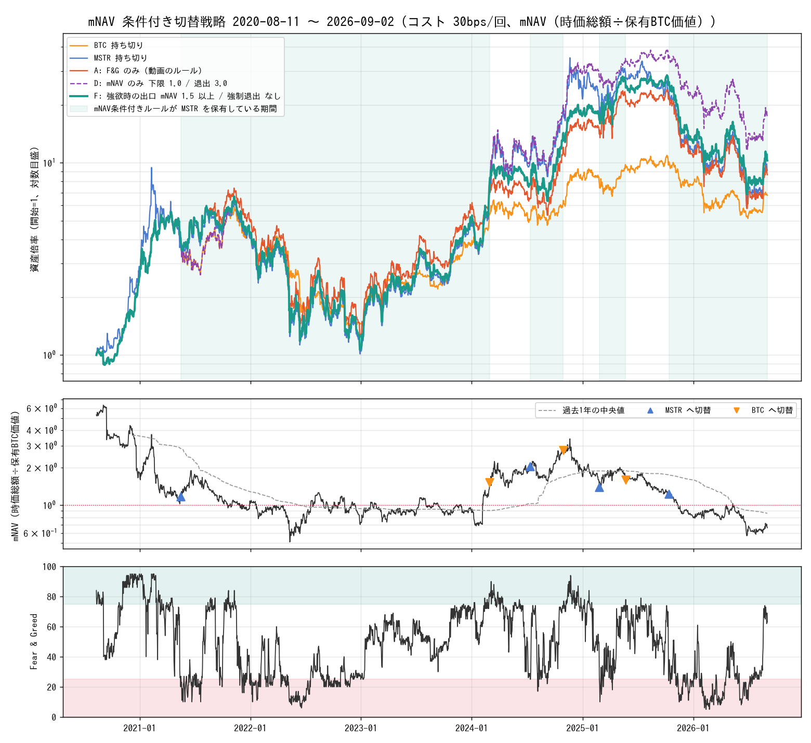

# mNAV（プレミアム）条件を加えた再検証（2026-09-04 実施）

前回の検証（`backtest_2026-09-04.md`）で、Fear & Greed 指数だけの切替は
「MSTR のプレミアム（mNAV）が急変した 2 区間」で成績が決まっていることが分かった。
そこで mNAV を条件に加えた場合と、上げ相場だけで運用した場合を検証した。

## 要約

| 問い | 答え |
|---|---|
| 「極端な恐怖でも mNAV が高ければ MSTR に入らない」は効くか | 効かない。むしろ悪化する。2024 年のプレミアム拡大局面（MSTR が最も上がった時期）は mNAV が高い状態から始まったため、入口を絞ると取り逃す |
| 「極端な強欲でも mNAV が安ければ MSTR を売らない」は効くか | 効く。全期間・5 年・上げ相場・200 日移動平均レジームのすべてで元の方式を上回り、開始日を変えても勝率が落ちない |
| mNAV だけで動くとどうなるか | 成績は最も高いが、6 年で切替 3 回しかなく「2022 年の割安で買い、2024 年 11 月の 3 倍超で売った」という 2 つの判断に依存している。頑健とは言い切れない |
| 上げ相場だけで運用したら | 元の方式でも BTC 持ち切りには勝つ（サイクル区切りで 1.25 倍・2.14 倍）。ただし MSTR 持ち切りには届かない。出口に mNAV 条件を付けると MSTR 持ち切り並みかそれ以上になる |

## mNAV データ

| 項目 | 内容 |
|---|---|
| 出典 | mnav.com の Strategy ページに埋め込まれた日次データ（2020-08-10 〜 2026-09-04、2,217 日、暦日ベース） |
| 内容 | 株価、BTC 価格、保有 BTC、発行株数、時価総額、保有 BTC 価値、負債、優先株、現金、mNAV、購入台帳 119 件 |
| 検証 | 株価は Yahoo Finance の終値と一致（中央値の差 0.002%、最大 0.04%） |
| 採用した定義 | 時価総額 ÷ 保有 BTC 価値。同サイトの「mNAV」列は 2025 年 10 月以前は時価総額ベース、以後だけ負債・優先株込みの企業価値ベースに切り替わる不連続な系列だったため、全期間で定義が一貫する時価総額ベースを使用 |
| 注意 | 2020〜2021 年は保有 BTC が少なく、ソフトウェア事業の価値で mNAV が高く出る（2020 年中央値 3.59） |

年ごとの mNAV（時価総額ベース）

| 年 | 中央値 | 最小 | 最大 |
|---|---|---|---|
| 2020（8 月から） | 3.59 | 1.66 | 6.34 |
| 2021 | 1.28 | 0.91 | 3.69 |
| 2022 | 0.94 | 0.51 | 1.26 |
| 2023 | 0.91 | 0.72 | 1.15 |
| 2024 | 1.83 | 0.68 | 3.41 |
| 2025 | 1.59 | 0.80 | 2.14 |
| 2026（9 月 4 日まで） | 0.82 | 0.57 | 1.03 |

## 検証したルール

| 記号 | ルール |
|---|---|
| A | F&G のみ。極端な恐怖で MSTR、極端な強欲で BTC（動画の方式） |
| B | A に入口条件を追加。極端な恐怖でも mNAV が上限を超えていれば MSTR に入らない |
| C | B に強制退出を追加。mNAV が退出水準以上なら F&G に関係なく BTC |
| D | mNAV のみ。下限以下で MSTR、退出水準以上で BTC |
| E | 相対 mNAV。極端な恐怖のとき mNAV が過去 N 日の中央値より低ければ MSTR、高ければ BTC |
| F | A に出口条件を追加。極端な強欲でも mNAV が出口水準未満なら売らずに MSTR を持ち続ける |

前提（実行タイミング、コスト 0.3%、ウォームスタート等）は前回と同じ。データ最終日は 2026-09-02。

## 結果 1: ルール別の成績（主要な行）

「対 BTC」は BTC 持ち切りを 1 としたときの比。全期間は 2020-08-11 から、5 年は 2021-09-04 から。

| ルール | 5年 | 5年 対BTC | 全期間 | 全期間 対BTC | 全期間 対MSTR | 最大下落 | 切替 | 上げ相場B 対BTC | 200日MA上のみ 対BTC |
|---|---|---|---|---|---|---|---|---|---|
| A: F&G のみ | 1.48倍 | 0.95 | 8.66倍 | 1.28 | 0.95 | -83.2% | 11 | 2.14 | 1.53 |
| B: 入口上限 1.5 | 1.05倍 | 0.68 | 6.15倍 | 0.91 | 0.67 | -83.2% | 9 | 1.52 | 1.37 |
| C: 入口上限 1.5 / 強制退出 2.5 | 1.05倍 | 0.68 | 6.15倍 | 0.91 | 0.67 | -83.2% | 9 | 1.52 | 1.37 |
| D: mNAV のみ 1.0 / 3.0 | 3.96倍 | 2.56 | 17.35倍 | 2.56 | 1.90 | -84.1% | 3 | 4.06 | 3.13 |
| D: mNAV のみ 0.8 / 3.0 | 6.60倍 | 4.26 | 28.87倍 | 4.26 | 3.16 | -76.6% | 3 | 4.06 | 2.96 |
| E: 相対 mNAV N=365 | 2.04倍 | 1.32 | 11.99倍 | 1.77 | 1.31 | -81.3% | 21 | 1.92 | 1.37 |
| F: 出口 mNAV 1.5 以上 | 1.85倍 | 1.20 | 10.27倍 | 1.52 | 1.12 | -84.1% | 7 | 2.96 | 1.99 |
| F: 出口 mNAV 2.0 以上 | 2.20倍 | 1.42 | 12.20倍 | 1.80 | 1.34 | -84.1% | 5 | 3.69 | 2.36 |
| F: 出口 mNAV 2.5 以上 | 2.08倍 | 1.34 | 11.52倍 | 1.70 | 1.26 | -84.1% | 3 | 3.48 | 1.99 |
| BTC 持ち切り | 1.55倍 | 1.00 | 6.77倍 | 1.00 | 0.74 | -76.6% | 0 | 1.00 | 1.00 |
| MSTR 持ち切り | 1.73倍 | 1.12 | 9.13倍 | 1.35 | 1.00 | -89.3% | 0 | 2.77 | 1.58 |

全ルールの成績は付録に掲載。

## 結果 2: 上げ相場だけで運用した場合

サイクル区切り（後知恵。天井と底は BTC 終値から決定）

| 区間 | 期間 | BTC | MSTR | A: F&G のみ | D: 1.0 / 3.0 | E: N=365 | F: 出口 1.5 | F: 出口 2.0 |
|---|---|---|---|---|---|---|---|---|
| 上げ相場A | 2020-08-11 〜 2021-11-08 | +492% | +538% | +638% | +564% | +638% | +568% | +568% |
| 下げ相場A | 2021-11-08 〜 2022-11-21 | -77% | -82% | -81% | -82% | -70% | -82% | -82% |
| 上げ相場B | 2022-11-21 〜 2025-10-06 | +690% | +2,188% | +1,590% | +3,108% | +1,420% | +2,236% | +2,814% |
| 下げ相場B | 2025-10-06 〜 2026-06-30 | -53% | -76% | -75% | -69% | -75% | -75% | -76% |
| 反発 | 2026-06-30 〜 2026-09-02 | +32% | +42% | +42% | +42% | +42% | +42% | +42% |

BTC が 200 日移動平均より上にある期間（30 日以上続いたもの。実運用でも判定できる区切り）

| 期間 | 日数 | BTC | MSTR | A: F&G のみ | D: 1.0 / 3.0 | E: N=365 | F: 出口 1.5 | F: 出口 2.0 |
|---|---|---|---|---|---|---|---|---|
| 2020-08-11 〜 2021-05-18 | 280 | +276% | +261% | +279% | +276% | +279% | +279% | +279% |
| 2021-10-01 〜 2021-12-12 | 72 | +4% | -2% | +4% | +10% | +4% | -2% | -2% |
| 2023-01-13 〜 2023-08-16 | 215 | +44% | +70% | +70% | +70% | +70% | +70% | +70% |
| 2023-10-16 〜 2024-07-03 | 261 | +111% | +300% | +130% | +300% | +130% | +218% | +373% |
| 2024-10-14 〜 2025-03-08 | 145 | +30% | +42% | +71% | +73% | +54% | +71% | +71% |
| 2025-04-22 〜 2025-10-16 | 177 | +16% | -17% | +4% | +16% | +4% | +4% | -17% |

上げ相場の期間だけを連結した倍率（対 BTC 持ち切り）: A 1.53、D 3.13、E 1.37、F 1.5 で 1.99、F 2.0 で 2.36。
下げ相場ではどのルールも MSTR 持ち切りとほぼ同じ下落率になる。下げ相場を避けるかどうかは、この方式ではなく相場判断に依存する。

## 結果 3: ルール F（出口に mNAV 条件）の保有区間

| 期間 | 日数 | 実行日の指数 | 実行日の mNAV | 保有 | 保有資産 | 持たなかった方 | 差 |
|---|---|---|---|---|---|---|---|
| 2020-08-11 〜 2021-05-17 | 279 | 84 | 5.29 | BTC | +281.6% | +262.8% | +18.8% |
| 2021-05-17 〜 2024-03-01 | 1019 | 27 | 1.17 | MSTR | +120.6% | +43.4% | +77.2% |
| 2024-03-01 〜 2024-07-12 | 133 | 80 | 1.51 | BTC | -7.3% | +29.4% | -36.7% |
| 2024-07-12 〜 2024-10-30 | 110 | 25 | 2.03 | MSTR | +77.1% | +24.9% | +52.1% |
| 2024-10-30 〜 2025-02-25 | 118 | 77 | 2.75 | BTC | +22.7% | +1.3% | +21.4% |
| 2025-02-25 〜 2025-05-23 | 87 | 25 | 1.39 | MSTR | +47.5% | +20.9% | +26.6% |
| 2025-05-23 〜 2025-10-13 | 143 | 78 | 1.59 | BTC | +7.4% | -14.6% | +22.1% |
| 2025-10-13 〜 2026-09-02（継続中） | 324 | 38 | 1.23 | MSTR | -61.0% | -32.9% | -28.0% |

正解 6 / 8。元の方式との違いは、2024 年 1 月の極端な強欲（mNAV 0.76）で MSTR を売らなかった点に尽きる。
2025 年 10 月以降の区間（mNAV 1.23 で MSTR に入り、その後プレミアムが崩壊）は改善しない。

ルール D（mNAV のみ 1.0 / 3.0）の保有区間

| 期間 | 日数 | 実行日の mNAV | 保有 | 保有資産 | 持たなかった方 | 差 |
|---|---|---|---|---|---|---|
| 2020-08-11 〜 2021-10-19 | 434 | 5.29 | BTC | +463.2% | +439.1% | +24.0% |
| 2021-10-19 〜 2024-11-12 | 1120 | 0.95 | MSTR | +390.3% | +36.9% | +353.5% |
| 2024-11-12 〜 2025-11-12 | 365 | 3.06 | BTC | +15.6% | -37.0% | +52.6% |
| 2025-11-12 〜 2026-09-02（継続中） | 294 | 0.99 | MSTR | -45.2% | -24.0% | -21.2% |

## 結果 4: 開始日を変えた場合（終了日固定、対 BTC 持ち切り）

| 開始日 | A: F&G のみ | F: 出口 1.5 | D: 1.0 / 3.0 |
|---|---|---|---|
| 2020-10-01 | 1.28 | 1.52 | 2.56 |
| 2021-01-01 | 1.28 | 1.52 | 2.56 |
| 2021-04-01 | 1.28 | 1.52 | 2.56 |
| 2021-07-01 | 0.74 | 0.88 | 2.56 |
| 2021-10-01 | 1.03 | 1.34 | 2.56 |
| 2022-01-01 | 1.08 | 1.50 | 2.55 |
| 2022-04-01 | 1.17 | 1.61 | 2.74 |
| 2022-07-01 | 1.43 | 1.97 | 3.36 |
| 2022-10-01 | 1.12 | 1.55 | 2.65 |
| 2023-01-01 | 1.45 | 2.01 | 3.41 |
| 2023-04-01 | 1.20 | 1.66 | 2.83 |
| 2023-07-01 | 1.10 | 1.53 | 2.60 |
| 2023-10-01 | 1.05 | 1.46 | 2.48 |
| 2024-01-01 | 0.86 | 1.19 | 2.03 |
| 2024-04-01 | 0.99 | 0.99 | 1.24 |
| 2024-07-01 | 0.99 | 0.99 | 1.34 |
| 2024-10-01 | 0.90 | 0.90 | 1.09 |
| 2025-01-01 | 0.70 | 0.70 | 0.72 |
| 2025-04-01 | 0.55 | 0.55 | 0.72 |
| 2025-07-01 | 0.58 | 0.58 | 0.72 |

BTC 持ち切りに勝った開始日: A 12 / 20、F 13 / 20、D 17 / 20。
2024 年以降に始めた場合はどのルールも BTC に負けている。2025 年 10 月からのプレミアム崩壊を
どのルールも回避できていないため。

## 現在の判定（2026-09-04 時点）

| 項目 | 値 |
|---|---|
| Fear & Greed | 74（Greed。9 月 2 日時点は 63） |
| mNAV 時価総額ベース | 0.75（9 月 2 日時点は 0.66） |
| mNAV 企業価値ベース（公式定義。負債と優先株を含む） | 1.06 |
| 過去 1 年の mNAV 中央値（時価総額ベース） | 0.86 |
| ルール A・F・D のポジション | いずれも MSTR 保有中 |
| ルール F で次に BTC へ戻す条件 | 極端な強欲、かつ mNAV 1.5 以上（時価総額ベース） |
| ルール D で次に BTC へ戻す条件 | mNAV 3.0 以上（時価総額ベース） |

企業価値ベースの mNAV は、時価総額ベースに「（負債 + 優先株 − 現金）÷ 保有 BTC 価値」を足したもので、
現在はおよそ 0.31 の差がある。この検証のしきい値 1.5 は、公式定義ではおよそ 1.8 に相当する。
実運用では「時価総額 ÷（保有 BTC 枚数 × BTC 価格）」を自分で計算して判定するのが一貫性の面で安全。

## 解釈と注意点

- **F&G は「入口」としては機能している。** 極端な恐怖で MSTR に入った区間は、プレミアム崩壊局面を除きすべて BTC を上回った。
- **F&G は「出口」としては弱い。** 極端な強欲は BTC の短期的な過熱を示すが、MSTR のプレミアムがまだ低い局面（2024 年 1 月）で売ると、その後のプレミアム拡大を丸ごと逃す。出口に mNAV 条件を足す理由はここにある。
- **mNAV の極端値は強い信号だった。** 1.0 以下で買い、3.0 以上で売る単純な規則が最良だった。ただし該当する局面は 2021 年、2024 年、2025 年の 3 回しかなく、次のサイクルで同じ水準が再現する保証はない。
- **どのルールも 2025 年 10 月以降の下落は避けられない。** mNAV 1.2 前後で MSTR に入り、その後 0.6 まで崩れた。プレミアムの「水準」だけでは崩壊の始まりを判定できない。
- **上げ相場に限定するなら、この方式の主な役割は「上げ相場の中の押し目で MSTR の比率を上げる」こと。** 上げ相場 B では元の方式で BTC の 2.1 倍、出口条件付きで 3.0〜3.7 倍、MSTR 持ち切りで 2.8 倍。下げ相場に入ったときの損失はどのルールも MSTR 持ち切りと同じで、相場判断の側で止める必要がある。
- **過学習の注意。** ルール F と D のしきい値は結果を見てから選んでいる。付録の全グリッドを見ると、F は 1.0 から 2.5 のどのしきい値でも A を上回り、D は退出 3.5 以上で急に悪化する（2024 年 11 月の最大値 3.41 を超えないため）。F の方が結論の安定性は高い。
- 税金と売買コスト、円の資金移動は前回と同様に考慮していない。

## 図



上段が資産曲線（緑がルール F、紫の破線がルール D、赤が元の方式、橙が BTC、青が MSTR）、
中段が mNAV（時価総額ベース、点線は過去 1 年の中央値、赤い点線は 1.0）、下段が Fear & Greed 指数。

## 再現方法

```bash
python3 006_fear-greed-switcher/scripts/fetch_data.py                 # 指数と価格
python3 006_fear-greed-switcher/scripts/fetch_mstr_fundamentals.py    # mNAV 日次データ
python3 006_fear-greed-switcher/scripts/backtest_mnav.py --mnav-kind mnav_mcap --out ./out
```

## 付録: 全ルールの成績（コスト 0.3%、mNAV は時価総額ベース）

| ルール | 5年 | 5年 対BTC | 全期間 | 全期間 対BTC | 全期間 対MSTR | 最大下落 | 切替 | 上げ相場A 対BTC | 上げ相場B 対BTC | 200日MA上のみ 対BTC | 同 対MSTR |
|---|---|---|---|---|---|---|---|---|---|---|---|
| A: F&G のみ（元の方式） | 1.48 | 0.95 | 8.66 | 1.28 | 0.95 | -83.2% | 11 | 1.25 | 2.14 | 1.53 | 0.97 |
| B: F&G + 入口上限 1.0 | 1.17 | 0.76 | 5.14 | 0.76 | 0.56 | -82.9% | 3 | 1.00 | 1.25 | 1.31 | 0.83 |
| B: F&G + 入口上限 1.25 | 0.86 | 0.56 | 5.07 | 0.75 | 0.56 | -83.2% | 7 | 1.25 | 1.25 | 1.24 | 0.79 |
| B: F&G + 入口上限 1.5 | 1.05 | 0.68 | 6.15 | 0.91 | 0.67 | -83.2% | 9 | 1.25 | 1.52 | 1.37 | 0.87 |
| B: F&G + 入口上限 2.0 | 1.43 | 0.93 | 8.41 | 1.24 | 0.92 | -83.2% | 11 | 1.25 | 2.08 | 1.53 | 0.97 |
| B: F&G + 入口上限 2.5 | 1.48 | 0.95 | 8.66 | 1.28 | 0.95 | -83.2% | 11 | 1.25 | 2.14 | 1.53 | 0.97 |
| C: F&G + 入口上限 1.5 / 強制退出 2.0 | 1.24 | 0.80 | 7.28 | 1.07 | 0.80 | -83.2% | 9 | 1.25 | 1.80 | 1.62 | 1.03 |
| C: F&G + 入口上限 1.5 / 強制退出 2.5 | 1.05 | 0.68 | 6.15 | 0.91 | 0.67 | -83.2% | 9 | 1.25 | 1.52 | 1.37 | 0.87 |
| C: F&G + 入口上限 2.0 / 強制退出 2.5 | 1.31 | 0.84 | 7.67 | 1.13 | 0.84 | -83.2% | 11 | 1.25 | 1.89 | 1.37 | 0.87 |
| C: F&G + 入口上限 2.0 / 強制退出 3.0 | 1.43 | 0.93 | 8.41 | 1.24 | 0.92 | -83.2% | 11 | 1.25 | 2.08 | 1.53 | 0.97 |
| D: mNAV のみ 下限 0.6 / 退出 2.0 | 7.56 | 4.88 | 33.08 | 4.88 | 3.62 | -65.3% | 3 | 1.00 | 2.57 | 2.65 | 1.68 |
| D: mNAV のみ 下限 0.6 / 退出 2.5 | 9.17 | 5.93 | 40.16 | 5.93 | 4.40 | -65.3% | 3 | 1.00 | 3.12 | 2.24 | 1.42 |
| D: mNAV のみ 下限 0.6 / 退出 3.0 | 11.93 | 7.71 | 52.22 | 7.71 | 5.72 | -65.3% | 3 | 1.00 | 4.06 | 2.96 | 1.88 |
| D: mNAV のみ 下限 0.6 / 退出 3.5 | 4.23 | 2.73 | 18.51 | 2.73 | 2.03 | -82.6% | 1 | 1.00 | 2.90 | 1.75 | 1.11 |
| D: mNAV のみ 下限 0.8 / 退出 2.0 | 4.18 | 2.70 | 18.29 | 2.70 | 2.00 | -76.6% | 3 | 1.00 | 2.57 | 2.65 | 1.68 |
| D: mNAV のみ 下限 0.8 / 退出 2.5 | 5.07 | 3.28 | 22.20 | 3.28 | 2.43 | -76.6% | 3 | 1.00 | 3.12 | 2.24 | 1.42 |
| D: mNAV のみ 下限 0.8 / 退出 3.0 | 6.60 | 4.26 | 28.87 | 4.26 | 3.16 | -76.6% | 3 | 1.00 | 4.06 | 2.96 | 1.88 |
| D: mNAV のみ 下限 0.8 / 退出 3.5 | 2.86 | 1.85 | 12.51 | 1.85 | 1.37 | -82.6% | 1 | 1.00 | 2.90 | 1.75 | 1.11 |
| D: mNAV のみ 下限 1.0 / 退出 2.0 | 2.51 | 1.62 | 10.99 | 1.62 | 1.20 | -84.1% | 3 | 1.12 | 2.57 | 2.80 | 1.77 |
| D: mNAV のみ 下限 1.0 / 退出 2.5 | 3.05 | 1.97 | 13.34 | 1.97 | 1.46 | -84.1% | 3 | 1.12 | 3.12 | 2.37 | 1.50 |
| D: mNAV のみ 下限 1.0 / 退出 3.0 | 3.96 | 2.56 | 17.35 | 2.56 | 1.90 | -84.1% | 3 | 1.12 | 4.06 | 3.13 | 1.98 |
| D: mNAV のみ 下限 1.0 / 退出 3.5 | 2.17 | 1.40 | 9.51 | 1.40 | 1.04 | -84.1% | 1 | 1.12 | 2.90 | 1.85 | 1.17 |
| D: mNAV のみ 下限 1.25 / 退出 2.0 | 1.60 | 1.03 | 8.46 | 1.25 | 0.93 | -84.1% | 3 | 1.08 | 2.68 | 2.28 | 1.44 |
| D: mNAV のみ 下限 1.25 / 退出 2.5 | 1.94 | 1.26 | 10.27 | 1.52 | 1.12 | -84.1% | 3 | 1.08 | 3.25 | 1.92 | 1.22 |
| D: mNAV のみ 下限 1.25 / 退出 3.0 | 2.53 | 1.63 | 13.35 | 1.97 | 1.46 | -84.1% | 3 | 1.08 | 4.23 | 2.55 | 1.61 |
| D: mNAV のみ 下限 1.25 / 退出 3.5 | 1.73 | 1.12 | 9.14 | 1.35 | 1.00 | -84.1% | 1 | 1.08 | 2.90 | 1.58 | 1.00 |
| D: mNAV のみ 下限 1.5 / 退出 2.0 | 2.40 | 1.55 | 10.53 | 1.56 | 1.15 | -84.1% | 7 | 0.90 | 4.01 | 2.57 | 1.63 |
| D: mNAV のみ 下限 1.5 / 退出 2.5 | 1.90 | 1.23 | 8.34 | 1.23 | 0.91 | -84.1% | 3 | 0.90 | 3.18 | 1.42 | 0.90 |
| D: mNAV のみ 下限 1.5 / 退出 3.0 | 2.47 | 1.60 | 10.85 | 1.60 | 1.19 | -84.1% | 3 | 0.90 | 4.13 | 1.88 | 1.19 |
| D: mNAV のみ 下限 1.5 / 退出 3.5 | 1.73 | 1.12 | 7.60 | 1.12 | 0.83 | -84.1% | 1 | 0.90 | 2.90 | 1.32 | 0.83 |
| E: 相対 mNAV N=180 係数0.8 | 2.29 | 1.48 | 11.67 | 1.72 | 1.28 | -70.4% | 27 | 1.16 | 1.55 | 1.18 | 0.75 |
| E: 相対 mNAV N=180 係数1.0 | 2.48 | 1.60 | 16.23 | 2.40 | 1.78 | -80.7% | 37 | 1.39 | 2.97 | 1.53 | 0.97 |
| E: 相対 mNAV N=180 係数1.2 | 2.08 | 1.35 | 11.98 | 1.77 | 1.31 | -81.3% | 21 | 1.22 | 2.14 | 1.53 | 0.97 |
| E: 相対 mNAV N=365 係数0.8 | 1.73 | 1.12 | 10.56 | 1.56 | 1.16 | -74.4% | 29 | 1.30 | 1.45 | 1.17 | 0.74 |
| E: 相対 mNAV N=365 係数1.0 | 2.04 | 1.32 | 11.99 | 1.77 | 1.31 | -81.3% | 21 | 1.25 | 1.92 | 1.37 | 0.87 |
| E: 相対 mNAV N=365 係数1.2 | 2.24 | 1.45 | 13.17 | 1.94 | 1.44 | -81.3% | 13 | 1.25 | 2.43 | 1.53 | 0.97 |
| E: 相対 mNAV N=730 係数0.8 | 1.12 | 0.72 | 6.83 | 1.01 | 0.75 | -81.3% | 17 | 1.30 | 1.16 | 0.96 | 0.61 |
| E: 相対 mNAV N=730 係数1.0 | 1.32 | 0.86 | 7.76 | 1.15 | 0.85 | -81.3% | 11 | 1.25 | 1.44 | 1.24 | 0.79 |
| E: 相対 mNAV N=730 係数1.2 | 1.05 | 0.68 | 6.15 | 0.91 | 0.67 | -83.2% | 9 | 1.25 | 1.52 | 1.37 | 0.87 |
| F: 強欲時の出口 mNAV 1.0 以上 / 強制退出 3.0 | 1.63 | 1.05 | 9.54 | 1.41 | 1.04 | -83.2% | 11 | 1.25 | 2.36 | 1.69 | 1.07 |
| F: 強欲時の出口 mNAV 1.0 以上 / 強制退出 なし | 1.63 | 1.05 | 9.54 | 1.41 | 1.04 | -83.2% | 11 | 1.25 | 2.36 | 1.69 | 1.07 |
| F: 強欲時の出口 mNAV 1.25 以上 / 強制退出 3.0 | 1.69 | 1.09 | 9.94 | 1.47 | 1.09 | -84.1% | 9 | 1.24 | 2.61 | 1.76 | 1.11 |
| F: 強欲時の出口 mNAV 1.25 以上 / 強制退出 なし | 1.69 | 1.09 | 9.94 | 1.47 | 1.09 | -84.1% | 9 | 1.24 | 2.61 | 1.76 | 1.11 |
| F: 強欲時の出口 mNAV 1.5 以上 / 強制退出 3.0 | 1.85 | 1.20 | 10.27 | 1.52 | 1.12 | -84.1% | 7 | 1.13 | 2.96 | 1.99 | 1.26 |
| F: 強欲時の出口 mNAV 1.5 以上 / 強制退出 なし | 1.85 | 1.20 | 10.27 | 1.52 | 1.12 | -84.1% | 7 | 1.13 | 2.96 | 1.99 | 1.26 |
| F: 強欲時の出口 mNAV 2.0 以上 / 強制退出 3.0 | 2.20 | 1.42 | 12.20 | 1.80 | 1.34 | -84.1% | 5 | 1.13 | 3.69 | 2.36 | 1.49 |
| F: 強欲時の出口 mNAV 2.0 以上 / 強制退出 なし | 2.20 | 1.42 | 12.20 | 1.80 | 1.34 | -84.1% | 5 | 1.13 | 3.69 | 2.36 | 1.49 |
| F: 強欲時の出口 mNAV 2.5 以上 / 強制退出 3.0 | 2.08 | 1.34 | 11.52 | 1.70 | 1.26 | -84.1% | 3 | 1.13 | 3.48 | 1.99 | 1.26 |
| F: 強欲時の出口 mNAV 2.5 以上 / 強制退出 なし | 2.08 | 1.34 | 11.52 | 1.70 | 1.26 | -84.1% | 3 | 1.13 | 3.48 | 1.99 | 1.26 |
