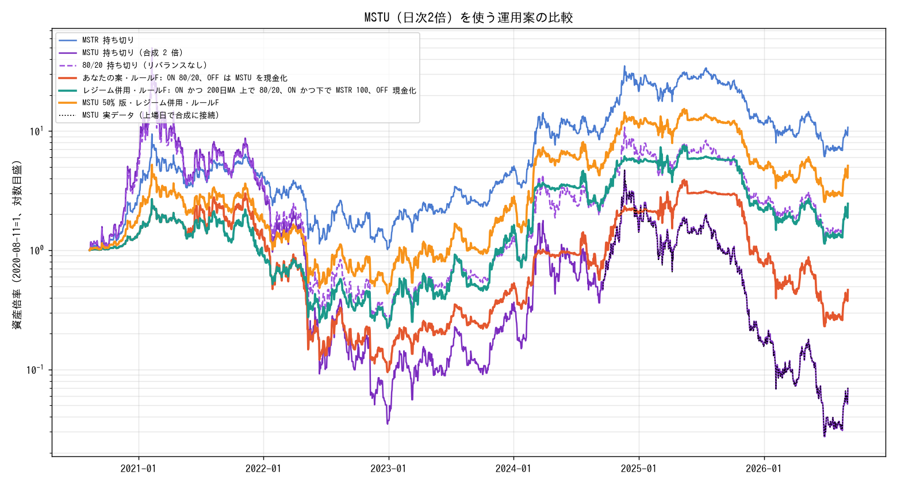

# MSTU（MSTR の日次 2 倍 ETF）を使う場合の検証（2026-09-04 実施）

保有が「MSTU 80%、MSTR 20%、BTC なし」で、強欲側のシグナルで MSTU を減らし恐怖で買い戻す運用を
考えている、という前提で検証した。MSTU は 2024-09-18 上場のため、実データで日次 2 倍の合成系列を
較正し、2020-08-11 からの長期で比較した。

## MSTU の実データ

| 項目 | 値 |
|---|---|
| 期間 | 2024-09-18 から 2026-09-03（492 営業日） |
| MSTU の騰落 | -85%（MSTR は +9%） |
| MSTR に対する日次ベータ / 相関 | 1.97 / 0.999 |
| 2 倍複利の減価を除いた実測コスト | 0.142% / 営業日（年率およそ 36%）。経費と金利の想定 6.5% を大きく超える |

日次リターンは正確に 2 倍だが、上下動のたびに減価し、MSTR が横ばいでも MSTU は減る。
較正期間には MSTU がスワップを確保できず追随が悪化した 2024 年末が含まれるため、今後の減価はこれより小さい可能性がある。

| 局面 | 期間 | MSTR | 合成 MSTU | 80/20 |
|---|---|---|---|---|
| 長い横ばい | 2021-11-08 から 2024-01-09 | 0.67倍 | 0.03倍 | 0.13倍 |
| 急騰局面 | 2024-07-12 から 2024-11-20 | 3.39倍 | 7.19倍 | 4.16倍 |
| 天井から底 | 2025-10-06 から 2026-06-30 | 0.24倍 | 0.03倍 | 0.21倍 |
| 底から現在 | 2026-06-30 から 2026-09-03 | 1.67倍 | 2.31倍 | 1.68倍 |

## 戦略比較（2020-08-11 開始、切替コスト 0.3%、較正済みコスト）

| 戦略 | 全期間 | 最大下落 | 上げ相場B | 下げ相場B | 現在の区間（2025-10-13 から） |
|---|---|---|---|---|---|
| MSTR 持ち切り | 10.74倍 | -89% | 22.9倍 | 0.24倍 | 0.46倍 |
| MSTU 持ち切り | 0.07倍 | -99.9% | 21.3倍 | 0.03倍 | 0.09倍 |
| 80/20 持ち切り（リバランスなし） | 2.20倍 | -99.4% | 22.7倍 | 0.21倍 | 0.41倍 |
| 提案の案（80/20、強欲側シグナルで MSTU を現金化、恐怖で買い戻し） | 0.46倍 | -97% | 26.6倍 | 0.08倍 | 0.16倍 |
| 同案で MSTU を 30% に | 4.86倍 | -92% | 23.6倍 | 0.19倍 | 0.35倍 |
| 恐怖で入って 90 日だけ 80/20、あとは MSTR | 6.92倍 | -91% | 26.0倍 | 0.13倍 | 0.25倍 |
| トレンド併用: BTC が 200 日 MA±3% で強気のときだけ MSTU 80%、弱気なら MSTR 100%、強欲側シグナルでも MSTR へ | 7.48倍 | -94% | 27.7倍 | 0.20倍 | 0.45倍 |
| 同じトレンド併用で MSTU 50% | 9.27倍 | -92% | 27.4倍 | 0.22倍 | 0.45倍 |
| 同じトレンド併用で MSTU 30% | 10.20倍 | -91% | 26.2倍 | 0.23倍 | 0.46倍 |

減価が理想的な場合（年率 6.5%）で再計算しても、提案の案は 0.78倍、MSTU 50% のトレンド併用は 11.9倍で順位は変わらない。

## 結論

- F&G のシグナルは「恐怖で買い戻す」には使えるが、下げ相場そのものを知らせない。MSTU の比率を下げる判断はトレンド（BTC の 200 日移動平均 ±3% の帯）で別に持つ。
- MSTU の比率は 30〜50% まで落とし、残りを MSTR にする。80% はどの変種でも最悪に近い。
- 減らした分は、上げ相場中の強欲シグナルなら MSTR へ。現金化はトレンド崩れのときだけ。
- MSTU は急騰局面だけ乗る道具で、横ばいでは毎月 3% 前後ずつ減る。

ダッシュボードには「トレンド判定（BTC 200 日 MA±3%、MSTR 100 日 MA）」と「MSTU の目安」として実装した。
サンプルには上げ相場が 2 回しかなく、最適な比率は特定できない。「比率を下げる」「トレンド崩れで外す」という方向だけが全変種で共通して効いた結論。

